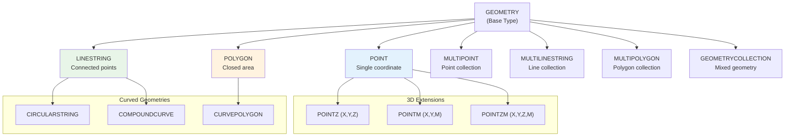
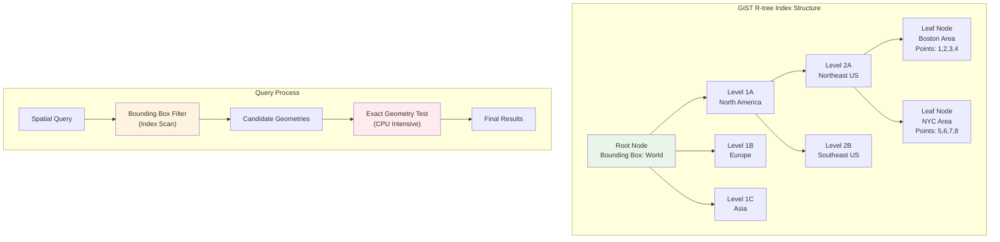

# Introduction to PostGIS

PostGIS is a spatial database extension for PostgreSQL that adds support for geographic objects and spatial operations.


## What is PostGIS?

PostGIS transforms PostgreSQL into a spatial database by adding:

- **Geometry Types**: Points, lines, polygons, and complex geometries
- **Spatial Functions**: Distance, area, intersection, buffer calculations
- **Spatial Indexing**: Fast spatial queries using GiST (R-tree) indexes
- **Standards Compliance**: OGC Simple Features and SQL/MM standards
- **Coordinate Reference Systems**: Support for thousands of projections
- **Raster Support**: Store and analyze raster/satellite imagery
- **Topology**: Maintain spatial relationships and data integrity
****
## Installing PostGIS

### Using Docker (Recommended for Workshop)
```bash
# PostGIS-enabled PostgreSQL container
docker run --name postgis-container \
  -e POSTGRES_PASSWORD=workshop123 \
  -e POSTGRES_DB=workshop \
  -p 5432:5432 \
  -d postgis/postgis:15-3.3
```

### Manual Installation
```sql
-- Enable PostGIS extension
CREATE EXTENSION postgis;
CREATE EXTENSION postgis_topology;
```

## Spatial Data Types Hierarchy



### Geometry Types in Practice
```sql
-- Point geometries
SELECT ST_GeomFromText('POINT(-71.064544 42.358431)', 4326);
SELECT ST_MakePoint(-71.064544, 42.358431);
SELECT ST_SetSRID(ST_MakePoint(-71.064544, 42.358431), 4326);

-- 3D Point
SELECT ST_MakePoint(-71.064544, 42.358431, 10.5); -- X, Y, Z

-- LineString geometries
SELECT ST_GeomFromText('LINESTRING(-71.160281 42.258729, -71.160837 42.259113)', 4326);
SELECT ST_MakeLine(ARRAY[
    ST_MakePoint(-71.160281, 42.258729),
    ST_MakePoint(-71.160837, 42.259113)
]);

-- Polygon geometries
SELECT ST_GeomFromText('POLYGON((
    -71.1776 42.3902, 
    -71.1776 42.3903, 
    -71.1775 42.3903, 
    -71.1775 42.3902, 
    -71.1776 42.3902
))', 4326);

-- Polygon with hole
SELECT ST_GeomFromText('POLYGON((
    -71.18 42.39, -71.18 42.40, -71.17 42.40, -71.17 42.39, -71.18 42.39
), (
    -71.175 42.395, -71.175 42.396, -71.174 42.396, -71.174 42.395, -71.175 42.395
))', 4326);
```

### Creating Spatial Tables
```sql
CREATE TABLE locations (
    id SERIAL PRIMARY KEY,
    name VARCHAR(100),
    location GEOMETRY(POINT, 4326), -- WGS84 coordinate system
    created_at TIMESTAMP DEFAULT NOW()
);

-- Add spatial index
CREATE INDEX idx_locations_geom ON locations USING GIST(location);
```


## Working with Spatial Data

### Coordinate System Management
```sql
-- Check available coordinate systems
SELECT srid, auth_name, auth_srid, srtext 
FROM spatial_ref_sys 
WHERE srid IN (4326, 3857, 2163)
ORDER BY srid;

-- Common SRID values:
-- 4326: WGS84 (GPS coordinates, degrees)
-- 3857: Web Mercator (web mapping, meters)
-- 2163: US National Atlas Equal Area (continental US)

-- Transform between coordinate systems
SELECT 
    ST_AsText(geom) as wgs84_degrees,
    ST_AsText(ST_Transform(geom, 3857)) as web_mercator_meters
FROM (SELECT ST_SetSRID(ST_MakePoint(-71.065, 42.355), 4326) as geom) t;
```

### Inserting Comprehensive Spatial Data
```sql
-- Create comprehensive locations table
CREATE TABLE locations (
    id SERIAL PRIMARY KEY,
    name VARCHAR(100) NOT NULL,
    description TEXT,
    category VARCHAR(50),
    location GEOMETRY(POINT, 4326),
    address VARCHAR(200),
    website VARCHAR(200),
    rating DECIMAL(2,1),
    created_at TIMESTAMP DEFAULT NOW()
);

-- Create spatial index
CREATE INDEX idx_locations_geom ON locations USING GIST(location);

-- Insert comprehensive Boston area locations
INSERT INTO locations (name, description, category, location, address, website, rating) VALUES
-- Educational institutions
('Harvard University', 'Prestigious Ivy League university founded in 1636', 'education', 
 ST_SetSRID(ST_MakePoint(-71.1167, 42.3770), 4326), 'Cambridge, MA 02138', 'https://harvard.edu', 4.8),
('MIT', 'Leading technology and engineering university', 'education',
 ST_SetSRID(ST_MakePoint(-71.0942, 42.3601), 4326), '77 Massachusetts Ave, Cambridge, MA 02139', 'https://mit.edu', 4.9),
('Boston University', 'Large private research university', 'education',
 ST_SetSRID(ST_MakePoint(-71.1043, 42.3505), 4326), '1 Silber Way, Boston, MA 02215', 'https://bu.edu', 4.3),
('Northeastern University', 'Private research university known for co-op program', 'education',
 ST_SetSRID(ST_MakePoint(-71.0890, 42.3398), 4326), '360 Huntington Ave, Boston, MA 02115', 'https://northeastern.edu', 4.4),

-- Parks and recreation
('Boston Common', 'Americas oldest public park, established in 1634', 'park',
 ST_SetSRID(ST_MakePoint(-71.0656, 42.3551), 4326), 'Boston, MA 02116', 'https://boston.gov/parks', 4.5),
('Central Park (Cambridge)', 'Large urban park with recreational facilities', 'park',
 ST_SetSRID(ST_MakePoint(-71.1190, 42.3736), 4326), 'Cambridge, MA 02139', NULL, 4.2),
('Charles River Esplanade', 'Scenic parkland along the Charles River', 'park',
 ST_SetSRID(ST_MakePoint(-71.0742, 42.3579), 4326), 'Boston, MA 02116', NULL, 4.6),

-- Sports venues
('Fenway Park', 'Historic baseball stadium, home of the Boston Red Sox', 'sports',
 ST_SetSRID(ST_MakePoint(-71.0972, 42.3467), 4326), '4 Yawkey Way, Boston, MA 02215', 'https://mlb.com/redsox', 4.7),
('TD Garden', 'Multi-purpose arena for Celtics and Bruins', 'sports',
 ST_SetSRID(ST_MakePoint(-71.0621, 42.3662), 4326), '100 Legends Way, Boston, MA 02114', 'https://tdgarden.com', 4.4),

-- Cultural attractions
('Museum of Science', 'Interactive science museum with planetarium', 'museum',
 ST_SetSRID(ST_MakePoint(-71.0711, 42.3676), 4326), '1 Science Park, Boston, MA 02114', 'https://mos.org', 4.5),
('Museum of Fine Arts', 'Comprehensive art museum with world-class collections', 'museum',
 ST_SetSRID(ST_MakePoint(-71.0940, 42.3394), 4326), '465 Huntington Ave, Boston, MA 02115', 'https://mfa.org', 4.6),
('Freedom Trail Start', 'Beginning of the historic Freedom Trail walking tour', 'historic',
 ST_SetSRID(ST_MakePoint(-71.0589, 42.3581), 4326), 'Boston Common, Boston, MA 02116', 'https://thefreedomtrail.org', 4.3),

-- Transportation hubs
('South Station', 'Major transportation hub for trains and buses', 'transportation',
 ST_SetSRID(ST_MakePoint(-71.0552, 42.3519), 4326), '700 Atlantic Ave, Boston, MA 02111', NULL, 3.8),
('Logan International Airport', 'Primary airport serving Boston metropolitan area', 'transportation',
 ST_SetSRID(ST_MakePoint(-71.0096, 42.3656), 4326), '1 Harborside Dr, Boston, MA 02128', 'https://massport.com/logan', 3.9),

-- Shopping and dining
('Quincy Market', 'Historic marketplace with food vendors and shops', 'shopping',
 ST_SetSRID(ST_MakePoint(-71.0546, 42.3601), 4326), '206 S Market St, Boston, MA 02109', NULL, 4.1),
('Harvard Square', 'Vibrant area with shops, restaurants, and street performers', 'shopping',
 ST_SetSRID(ST_MakePoint(-71.1190, 42.3736), 4326), 'Cambridge, MA 02138', NULL, 4.4);

-- Create regions table for administrative boundaries
CREATE TABLE regions (
    id SERIAL PRIMARY KEY,
    name VARCHAR(100) NOT NULL,
    region_type VARCHAR(50),
    boundary GEOMETRY(POLYGON, 4326),
    area_sqkm DECIMAL(10,2),
    population INTEGER,
    established_year INTEGER,
    description TEXT,
    created_at TIMESTAMP DEFAULT NOW()
);

CREATE INDEX idx_regions_boundary ON regions USING GIST(boundary);

-- Insert administrative regions
INSERT INTO regions (name, region_type, boundary, area_sqkm, population, established_year, description) VALUES
('Cambridge', 'city', 
 ST_SetSRID(ST_GeomFromText('POLYGON((
    -71.16 42.35, -71.16 42.41, -71.06 42.41, -71.06 42.35, -71.16 42.35
 ))'), 4326), 18.5, 118000, 1630, 'Home to Harvard and MIT universities'),
('Boston Downtown', 'district',
 ST_SetSRID(ST_GeomFromText('POLYGON((
    -71.08 42.34, -71.08 42.37, -71.04 42.37, -71.04 42.34, -71.08 42.34
 ))'), 4326), 12.3, 85000, 1630, 'Historic downtown core of Boston'),
('Back Bay', 'neighborhood',
 ST_SetSRID(ST_GeomFromText('POLYGON((
    -71.10 42.34, -71.10 42.36, -71.06 42.36, -71.06 42.34, -71.10 42.34
 ))'), 4326), 8.7, 45000, 1857, 'Victorian neighborhood built on filled land'),
('North End', 'neighborhood',
 ST_SetSRID(ST_GeomFromText('POLYGON((
    -71.06 42.36, -71.06 42.37, -71.04 42.37, -71.04 42.36, -71.06 42.36
 ))'), 4326), 2.1, 12000, 1630, 'Historic Italian-American neighborhood');

-- Create routes table for transportation lines
CREATE TABLE routes (
    id SERIAL PRIMARY KEY,
    name VARCHAR(100) NOT NULL,
    route_type VARCHAR(50),
    path GEOMETRY(LINESTRING, 4326),
    distance_km DECIMAL(8,2),
    description TEXT,
    operator VARCHAR(100),
    created_at TIMESTAMP DEFAULT NOW()
);

CREATE INDEX idx_routes_path ON routes USING GIST(path);

-- Insert transportation routes
INSERT INTO routes (name, route_type, path, distance_km, description, operator) VALUES
('Red Line (Harvard to South Station)', 'subway',
 ST_SetSRID(ST_GeomFromText('LINESTRING(
    -71.1167 42.3770, -71.1190 42.3736, -71.1043 42.3505, -71.0621 42.3662, -71.0552 42.3519
 )'), 4326), 12.5, 'MBTA Red Line subway route', 'MBTA'),
('Freedom Trail', 'walking',
 ST_SetSRID(ST_GeomFromText('LINESTRING(
    -71.0656 42.3551, -71.0589 42.3581, -71.0546 42.3601, -71.0621 42.3662, -71.0589 42.3581
 )'), 4326), 4.0, 'Historic walking trail through downtown Boston', 'City of Boston'),
('Charles River Path', 'cycling',
 ST_SetSRID(ST_GeomFromText('LINESTRING(
    -71.1190 42.3736, -71.0942 42.3601, -71.0742 42.3579, -71.0656 42.3551
 )'), 4326), 8.2, 'Scenic cycling and walking path along Charles River', 'DCR');
```

### Spatial Query Types and Performance

#### Distance Calculations and Proximity Analysis

```sql
-- Find all locations within 1km of Boston Common
SELECT 
    name,
    category,
    ROUND(ST_Distance(
        location::geography,
        ST_SetSRID(ST_MakePoint(-71.0656, 42.3551), 4326)::geography
    )::numeric, 2) as distance_meters
FROM locations
WHERE ST_DWithin(
    location::geography,
    ST_SetSRID(ST_MakePoint(-71.0656, 42.3551), 4326)::geography,
    1000
)
ORDER BY distance_meters;

-- Find nearest educational institutions to a point
SELECT 
    name,
    description,
    ROUND(ST_Distance(
        location::geography,
        ST_SetSRID(ST_MakePoint(-71.070, 42.360), 4326)::geography
    )::numeric, 2) as distance_meters
FROM locations
WHERE category = 'education'
ORDER BY location <-> ST_SetSRID(ST_MakePoint(-71.070, 42.360), 4326)
LIMIT 3;

-- Compare distance calculation methods
SELECT 
    name,
    -- Degrees (inaccurate for distance)
    ROUND(ST_Distance(
        location, 
        ST_SetSRID(ST_MakePoint(-71.0656, 42.3551), 4326)
    )::numeric, 6) as distance_degrees,
    
    -- Geography (spheroidal, accurate)
    ROUND(ST_Distance(
        location::geography,
        ST_SetSRID(ST_MakePoint(-71.0656, 42.3551), 4326)::geography
    )::numeric, 2) as distance_geography_m,
    
    -- Projected (planar, approximate)
    ROUND(ST_Distance(
        ST_Transform(location, 3857),
        ST_Transform(ST_SetSRID(ST_MakePoint(-71.0656, 42.3551), 4326), 3857)
    )::numeric, 2) as distance_projected_m
FROM locations
WHERE name IN ('Harvard University', 'MIT', 'Fenway Park')
ORDER BY distance_geography_m;
```

#### Nearest Neighbor
```sql
-- Find 3 nearest locations to a point
SELECT name, ST_Distance(location, ST_SetSRID(ST_MakePoint(-71.065, 42.355), 4326)) as distance
FROM locations
ORDER BY location <-> ST_SetSRID(ST_MakePoint(-71.065, 42.355), 4326)
LIMIT 3;
```

#### Area and Length
```sql
-- Create a polygon table
CREATE TABLE zones (
    id SERIAL PRIMARY KEY,
    name VARCHAR(100),
    boundary GEOMETRY(POLYGON, 4326)
);

-- Calculate area in square meters
SELECT name, ST_Area(ST_Transform(boundary, 3857)) as area_sqm
FROM zones;
```

## Advanced Spatial Operations

### Spatial Relationships

```sql
-- Find which locations are in each region
SELECT 
    r.name as region_name,
    r.region_type,
    l.name as location_name,
    l.category,
    l.rating
FROM regions r
JOIN locations l ON ST_Within(l.location, r.boundary)
ORDER BY r.name, l.category, l.name;

-- Analyze location distribution by region
SELECT 
    r.name as region_name,
    COUNT(l.id) as total_locations,
    COUNT(CASE WHEN l.category = 'education' THEN 1 END) as education_count,
    COUNT(CASE WHEN l.category = 'museum' THEN 1 END) as museum_count,
    COUNT(CASE WHEN l.category = 'park' THEN 1 END) as park_count,
    ROUND(AVG(l.rating), 2) as avg_rating
FROM regions r
LEFT JOIN locations l ON ST_Within(l.location, r.boundary)
GROUP BY r.id, r.name
ORDER BY total_locations DESC;

-- Find locations near region boundaries (within 200m)
SELECT 
    l.name as location_name,
    r.name as nearest_region,
    ROUND(ST_Distance(
        l.location::geography,
        ST_Boundary(r.boundary)::geography
    )::numeric, 2) as distance_to_boundary_m
FROM locations l
CROSS JOIN LATERAL (
    SELECT r.name, r.boundary
    FROM regions r
    ORDER BY ST_Distance(l.location::geography, ST_Boundary(r.boundary)::geography)
    LIMIT 1
) r
WHERE ST_Distance(
    l.location::geography,
    ST_Boundary(r.boundary)::geography
) < 200
ORDER BY distance_to_boundary_m;

-- Check which routes pass through regions
SELECT 
    rt.name as route_name,
    rt.route_type,
    r.name as region_name,
    ROUND(ST_Length(
        ST_Intersection(rt.path, r.boundary)::geography
    )::numeric, 2) as length_in_region_m
FROM routes rt
JOIN regions r ON ST_Intersects(rt.path, r.boundary)
WHERE ST_Length(ST_Intersection(rt.path, r.boundary)::geography) > 100
ORDER BY rt.name, length_in_region_m DESC;
```

### Advanced Geometric Operations


#### Buffer Analysis and Service Areas

```sql
-- Create service areas around educational institutions
WITH education_buffers AS (
    SELECT 
        name,
        category,
        location,
        ST_Buffer(location::geography, 500)::geometry as service_area_500m,
        ST_Buffer(location::geography, 1000)::geometry as service_area_1km
    FROM locations
    WHERE category = 'education'
)
SELECT 
    eb.name as institution,
    COUNT(l.id) as nearby_locations_500m,
    COUNT(l2.id) as nearby_locations_1km,
    STRING_AGG(DISTINCT l.category, ', ') as nearby_categories_500m
FROM education_buffers eb
LEFT JOIN locations l ON ST_Within(l.location, eb.service_area_500m) AND l.category != 'education'
LEFT JOIN locations l2 ON ST_Within(l2.location, eb.service_area_1km) AND l2.category != 'education'
GROUP BY eb.name
ORDER BY nearby_locations_500m DESC;

-- Analyze walkability - find locations within walking distance of transit
SELECT 
    l.name,
    l.category,
    l.rating,
    ROUND(ST_Distance(
        l.location::geography,
        (SELECT location FROM locations WHERE name = 'South Station')::geography
    )::numeric, 2) as distance_to_transit_m,
    CASE 
        WHEN ST_DWithin(
            l.location::geography,
            (SELECT location FROM locations WHERE name = 'South Station')::geography,
            400
        ) THEN 'Excellent walkability'
        WHEN ST_DWithin(
            l.location::geography,
            (SELECT location FROM locations WHERE name = 'South Station')::geography,
            800
        ) THEN 'Good walkability'
        ELSE 'Limited walkability'
    END as walkability_score
FROM locations l
WHERE l.category IN ('museum', 'shopping', 'sports')
ORDER BY distance_to_transit_m;
```

#### Route Analysis and Path Finding

```sql
-- Analyze routes and their characteristics
SELECT 
    name,
    route_type,
    ROUND(distance_km, 2) as distance_km,
    ROUND(ST_Length(path::geography)::numeric / 1000, 2) as calculated_distance_km,
    ST_NPoints(path) as waypoints,
    ROUND(ST_Length(path::geography)::numeric / ST_NPoints(path), 2) as avg_segment_length_m
FROM routes
ORDER BY distance_km DESC;

-- Find locations along routes (within 100m of path)
SELECT 
    r.name as route_name,
    l.name as location_name,
    l.category,
    ROUND(ST_Distance(
        l.location::geography,
        r.path::geography
    )::numeric, 2) as distance_to_route_m
FROM routes r
CROSS JOIN locations l
WHERE ST_DWithin(
    l.location::geography,
    r.path::geography,
    100
)
ORDER BY r.name, distance_to_route_m;

-- Create convex hull of all locations by category
SELECT 
    category,
    COUNT(*) as location_count,
    ROUND(ST_Area(ST_ConvexHull(ST_Collect(location))::geography)::numeric / 1000000, 2) as coverage_area_sqkm,
    ST_AsText(ST_Centroid(ST_Collect(location))) as geographic_center
FROM locations
GROUP BY category
HAVING COUNT(*) >= 2
ORDER BY coverage_area_sqkm DESC;
```

### Coordinate System Transformations
```sql
-- Comprehensive coordinate transformation examples
SELECT 
    name,
    -- Original coordinates (WGS84)
    ST_X(location) as longitude_wgs84,
    ST_Y(location) as latitude_wgs84,
    
    -- Web Mercator (for web mapping)
    ST_X(ST_Transform(location, 3857)) as x_web_mercator,
    ST_Y(ST_Transform(location, 3857)) as y_web_mercator,
    
    -- UTM Zone 19N (for New England area)
    ST_X(ST_Transform(location, 32619)) as x_utm_19n,
    ST_Y(ST_Transform(location, 32619)) as y_utm_19n,
    
    -- Different output formats
    ST_AsText(location) as wkt,
    ST_AsGeoJSON(location) as geojson,
    ST_AsKML(location) as kml,
    ST_AsBinary(location) as wkb_hex
FROM locations
WHERE name = 'Boston Common';

-- Batch transformation with accuracy comparison
WITH transformed_locations AS (
    SELECT 
        name,
        location as original_geom,
        ST_Transform(location, 3857) as web_mercator,
        ST_Transform(location, 32619) as utm_19n
    FROM locations
)
SELECT 
    l1.name as location1,
    l2.name as location2,
    
    -- Distance in degrees (inaccurate)
    ST_Distance(l1.original_geom, l2.original_geom) as distance_degrees,
    
    -- Distance using geography (spheroidal)
    ST_Distance(l1.original_geom::geography, l2.original_geom::geography) as distance_geography_m,
    
    -- Distance in Web Mercator (approximate)
    ST_Distance(l1.web_mercator, l2.web_mercator) as distance_web_mercator_m,
    
    -- Distance in UTM (most accurate for local area)
    ST_Distance(l1.utm_19n, l2.utm_19n) as distance_utm_m
FROM transformed_locations l1
CROSS JOIN transformed_locations l2
WHERE l1.name < l2.name;
```

## Spatial Indexing and Performance

### GiST Index Structure



### Spatial Views and Functions

#### Create Spatial Views
```sql
-- View for location analysis with spatial metrics
CREATE VIEW location_analysis AS
SELECT 
    l.id,
    l.name,
    l.category,
    l.rating,
    ST_X(l.location) as longitude,
    ST_Y(l.location) as latitude,
    ST_AsGeoJSON(l.location) as geojson,
    -- Distance to city center (Boston Common)
    ROUND(ST_Distance(
        l.location::geography,
        ST_SetSRID(ST_MakePoint(-71.0656, 42.3551), 4326)::geography
    )::numeric, 2) as distance_to_center_m,
    -- Which region contains this location
    (SELECT r.name FROM regions r WHERE ST_Within(l.location, r.boundary) LIMIT 1) as region_name
FROM locations l;

-- Query the spatial view
SELECT * FROM location_analysis WHERE category = 'education' ORDER BY distance_to_center_m;

-- Materialized view for expensive spatial calculations
CREATE MATERIALIZED VIEW spatial_statistics_mv AS
SELECT 
    category,
    COUNT(*) as location_count,
    ROUND(AVG(ST_Distance(
        location::geography,
        ST_SetSRID(ST_MakePoint(-71.0656, 42.3551), 4326)::geography
    ))::numeric, 2) as avg_distance_to_center_m,
    ROUND(ST_Area(ST_ConvexHull(ST_Collect(location))::geography)::numeric / 1000000, 2) as coverage_area_sqkm,
    ST_AsText(ST_Centroid(ST_Collect(location))) as category_centroid
FROM locations
GROUP BY category;

CREATE INDEX idx_spatial_stats_category ON spatial_statistics_mv(category);

-- Query spatial statistics
SELECT * FROM spatial_statistics_mv ORDER BY location_count DESC;
```

#### Spatial Functions
```sql
-- Function to find nearby locations
CREATE OR REPLACE FUNCTION find_nearby_locations(
    center_lng DECIMAL,
    center_lat DECIMAL,
    radius_meters INTEGER DEFAULT 1000,
    category_filter VARCHAR DEFAULT NULL
)
RETURNS TABLE(
    location_id INTEGER,
    location_name VARCHAR(100),
    category VARCHAR(50),
    distance_meters DECIMAL,
    rating DECIMAL,
    geojson TEXT
) AS $$
BEGIN
    RETURN QUERY
    SELECT 
        l.id,
        l.name,
        l.category,
        ROUND(ST_Distance(
            l.location::geography,
            ST_SetSRID(ST_MakePoint(center_lng, center_lat), 4326)::geography
        )::numeric, 2),
        l.rating,
        ST_AsGeoJSON(l.location)
    FROM locations l
    WHERE ST_DWithin(
        l.location::geography,
        ST_SetSRID(ST_MakePoint(center_lng, center_lat), 4326)::geography,
        radius_meters
    )
    AND (category_filter IS NULL OR l.category = category_filter)
    ORDER BY l.location <-> ST_SetSRID(ST_MakePoint(center_lng, center_lat), 4326);
END;
$$ LANGUAGE plpgsql;

-- Test the function
SELECT * FROM find_nearby_locations(-71.0656, 42.3551, 2000, 'education');

-- Function for route analysis
CREATE OR REPLACE FUNCTION analyze_route_accessibility(
    route_name VARCHAR,
    buffer_distance INTEGER DEFAULT 200
)
RETURNS TABLE(
    accessible_location VARCHAR(100),
    location_category VARCHAR(50),
    distance_to_route DECIMAL,
    location_rating DECIMAL
) AS $$
BEGIN
    RETURN QUERY
    SELECT 
        l.name,
        l.category,
        ROUND(ST_Distance(
            l.location::geography,
            r.path::geography
        )::numeric, 2),
        l.rating
    FROM locations l
    CROSS JOIN routes r
    WHERE r.name = route_name
    AND ST_DWithin(
        l.location::geography,
        r.path::geography,
        buffer_distance
    )
    ORDER BY ST_Distance(l.location::geography, r.path::geography);
END;
$$ LANGUAGE plpgsql;

-- Test route accessibility
SELECT * FROM analyze_route_accessibility('Freedom Trail', 300);

-- Function for spatial clustering analysis
CREATE OR REPLACE FUNCTION get_location_clusters(
    cluster_category VARCHAR,
    cluster_distance INTEGER DEFAULT 500
)
RETURNS TABLE(
    cluster_id INTEGER,
    location_name VARCHAR(100),
    cluster_center TEXT,
    locations_in_cluster BIGINT
) AS $$
BEGIN
    RETURN QUERY
    WITH clustered_locations AS (
        SELECT 
            l.name,
            l.location,
            ST_ClusterDBSCAN(l.location::geometry, cluster_distance, 2) OVER() as cluster_id
        FROM locations l
        WHERE l.category = cluster_category
    ),
    cluster_stats AS (
        SELECT 
            cluster_id,
            COUNT(*) as cluster_size,
            ST_AsText(ST_Centroid(ST_Collect(location))) as center
        FROM clustered_locations
        WHERE cluster_id IS NOT NULL
        GROUP BY cluster_id
    )
    SELECT 
        cl.cluster_id::INTEGER,
        cl.name,
        cs.center,
        cs.cluster_size
    FROM clustered_locations cl
    JOIN cluster_stats cs ON cl.cluster_id = cs.cluster_id
    WHERE cl.cluster_id IS NOT NULL
    ORDER BY cl.cluster_id, cl.name;
END;
$$ LANGUAGE plpgsql;

-- Test clustering
SELECT * FROM get_location_clusters('education', 1000);
```

#### Data Quality and Validation
```sql
-- Comprehensive spatial data quality check
CREATE OR REPLACE FUNCTION check_spatial_data_quality()
RETURNS TABLE(
    table_name TEXT,
    total_records BIGINT,
    valid_geometries BIGINT,
    invalid_geometries BIGINT,
    missing_srid BIGINT,
    quality_score DECIMAL
) AS $$
BEGIN
    RETURN QUERY
    SELECT 
        'locations'::TEXT,
        COUNT(*)::BIGINT,
        COUNT(CASE WHEN ST_IsValid(location) THEN 1 END)::BIGINT,
        COUNT(CASE WHEN NOT ST_IsValid(location) THEN 1 END)::BIGINT,
        COUNT(CASE WHEN ST_SRID(location) = 0 THEN 1 END)::BIGINT,
        ROUND(
            (COUNT(CASE WHEN ST_IsValid(location) AND ST_SRID(location) != 0 THEN 1 END)::DECIMAL / COUNT(*)) * 100,
            2
        )
    FROM locations
    UNION ALL
    SELECT 
        'regions'::TEXT,
        COUNT(*)::BIGINT,
        COUNT(CASE WHEN ST_IsValid(boundary) THEN 1 END)::BIGINT,
        COUNT(CASE WHEN NOT ST_IsValid(boundary) THEN 1 END)::BIGINT,
        COUNT(CASE WHEN ST_SRID(boundary) = 0 THEN 1 END)::BIGINT,
        ROUND(
            (COUNT(CASE WHEN ST_IsValid(boundary) AND ST_SRID(boundary) != 0 THEN 1 END)::DECIMAL / COUNT(*)) * 100,
            2
        )
    FROM regions
    UNION ALL
    SELECT 
        'routes'::TEXT,
        COUNT(*)::BIGINT,
        COUNT(CASE WHEN ST_IsValid(path) THEN 1 END)::BIGINT,
        COUNT(CASE WHEN NOT ST_IsValid(path) THEN 1 END)::BIGINT,
        COUNT(CASE WHEN ST_SRID(path) = 0 THEN 1 END)::BIGINT,
        ROUND(
            (COUNT(CASE WHEN ST_IsValid(path) AND ST_SRID(path) != 0 THEN 1 END)::DECIMAL / COUNT(*)) * 100,
            2
        )
    FROM routes;
END;
$$ LANGUAGE plpgsql;

-- Check data quality
SELECT * FROM check_spatial_data_quality();

-- Refresh materialized view
REFRESH MATERIALIZED VIEW spatial_statistics_mv;
```

## Data Import/Export

### Import from GeoJSON
```sql
-- Insert GeoJSON data
INSERT INTO locations (name, location) 
VALUES ('Custom Location', ST_GeomFromGeoJSON('{"type":"Point","coordinates":[-71.065,42.355]}'));
```

### Export as GeoJSON
```sql
-- Export as GeoJSON
SELECT jsonb_build_object(
    'type', 'Feature',
    'geometry', ST_AsGeoJSON(location)::jsonb,
    'properties', jsonb_build_object('name', name)
) as geojson
FROM locations;
```

## Best Practices

### Performance Best Practices
1. **Choose appropriate CRS** - WGS84 (4326) for storage, projected for calculations
2. **Create spatial indexes** - GiST indexes on all geometry columns
3. **Use ST_DWithin over ST_Distance** - More efficient for proximity queries
4. **Transform once, use many** - Cache transformed geometries when possible
5. **Validate geometries** - Use ST_IsValid() and fix issues early
6. **Simplify when appropriate** - Use ST_Simplify for display/analysis
