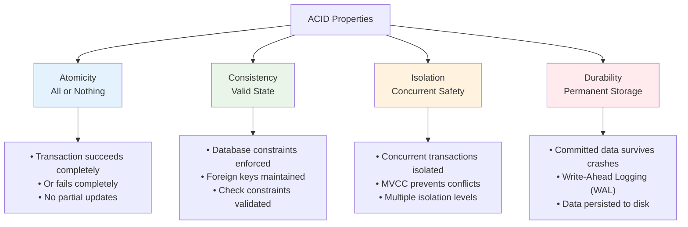
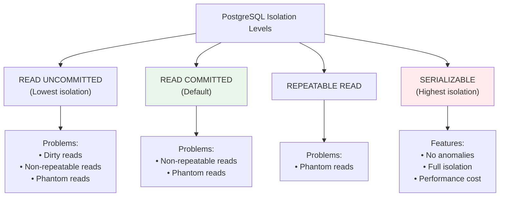
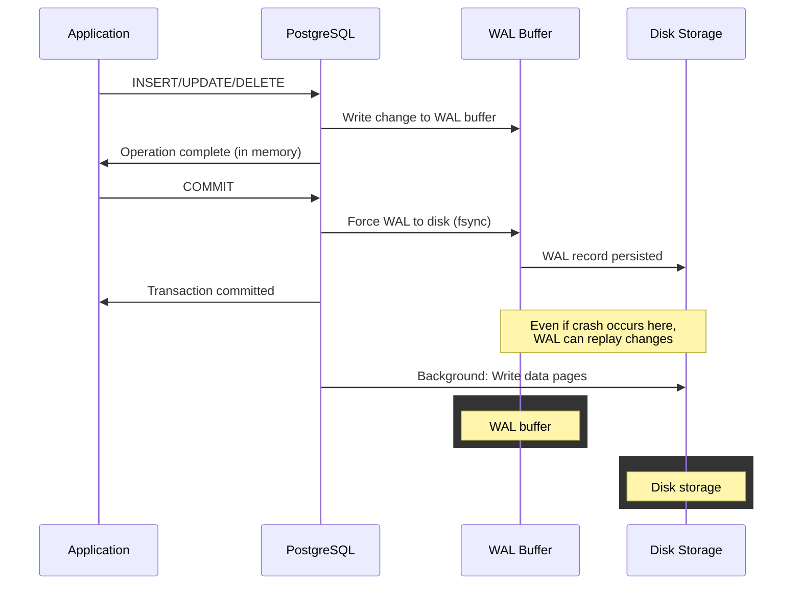
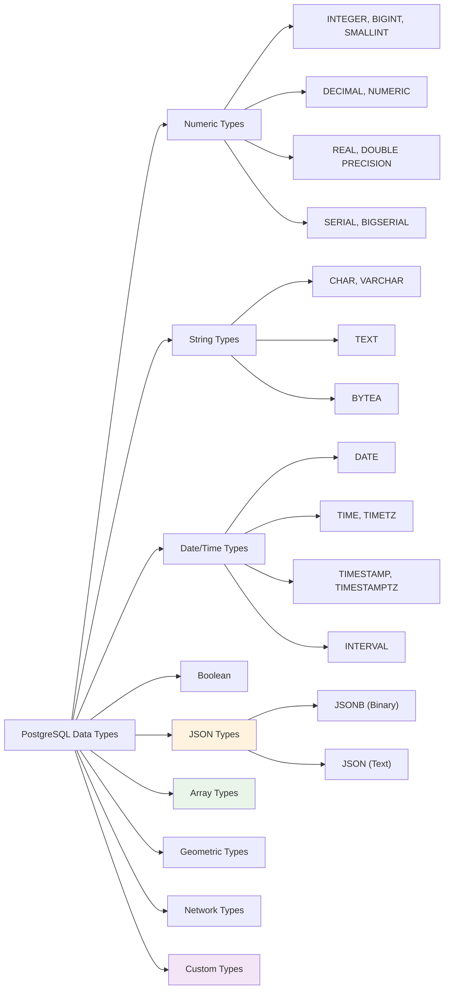

# Introduction to PostgreSQL

PostgreSQL is a powerful, open-source object-relational database system with a strong reputation for reliability, feature robustness, and performance.


## What is PostgreSQL?

PostgreSQL is an advanced relational database that supports both SQL (relational) and JSON (non-relational) querying. It's known for:

- **ACID Compliance**: Ensures data integrity through Atomicity, Consistency, Isolation, Durability
- **Extensibility**: Custom data types, operators, functions, and extensions
- **Standards Compliance**: Follows SQL standards closely with advanced features
- **Multi-Version Concurrency Control (MVCC)**: High concurrency without locking
- **Advanced Features**: JSON/JSONB, full-text search, spatial data, and more

## ACID Properties Explained



### Atomicity in Action
```sql
-- Example: Bank transfer (atomic transaction)
BEGIN;
    -- Deduct from account A
    UPDATE accounts SET balance = balance - 100 WHERE id = 1;
    
    -- Add to account B
    UPDATE accounts SET balance = balance + 100 WHERE id = 2;
    
    -- Check if both accounts have sufficient funds
    SELECT COUNT(*) FROM accounts WHERE id IN (1,2) AND balance >= 0;
    
    -- If any account goes negative, rollback everything
COMMIT; -- or ROLLBACK;
```

### Consistency Examples
```sql
-- Consistency through constraints
CREATE TABLE workshops (
    id SERIAL PRIMARY KEY,
    title VARCHAR(200) NOT NULL,
    duration INTEGER CHECK (duration > 0), -- Consistency rule
    max_participants INTEGER CHECK (max_participants > 0),
    instructor_id INTEGER REFERENCES instructors(id) -- Foreign key consistency
);

-- This will fail due to consistency constraints
INSERT INTO workshops (title, duration, max_participants) 
VALUES ('Bad Workshop', -30, 0); -- Violates CHECK constraints
```

### Isolation Levels


```sql
-- Demonstration of isolation levels
-- Session 1:
BEGIN ISOLATION LEVEL REPEATABLE READ;
SELECT balance FROM accounts WHERE id = 1; -- Returns 1000

-- Session 2 (concurrent):
UPDATE accounts SET balance = 1500 WHERE id = 1;
COMMIT;

-- Back to Session 1:
SELECT balance FROM accounts WHERE id = 1; -- Still returns 1000 (repeatable read)
COMMIT;

-- Now check again:
SELECT balance FROM accounts WHERE id = 1; -- Returns 1500
```

### Durability with WAL



```sql
-- Check WAL settings
SHOW wal_level;
SHOW fsync;
SHOW synchronous_commit;

-- View WAL activity
SELECT 
    pg_current_wal_lsn() as current_wal_position,
    pg_wal_lsn_diff(pg_current_wal_lsn(), '0/0') as wal_bytes_generated;

-- Force WAL sync (for testing)
SELECT pg_switch_wal();
```

## Key Features

### PostgreSQL Data Type System



### Data Types in Practice
PostgreSQL supports a rich set of data types:

```sql
-- Comprehensive data types example
CREATE TABLE comprehensive_example (
    id SERIAL PRIMARY KEY,
    
    -- Numeric types
    small_num SMALLINT,
    regular_num INTEGER,
    big_num BIGINT,
    precise_num DECIMAL(10,2),
    float_num REAL,
    
    -- String types
    fixed_string CHAR(10),
    variable_string VARCHAR(100),
    unlimited_text TEXT,
    
    -- Date/Time types
    birth_date DATE,
    appointment_time TIME,
    created_at TIMESTAMP DEFAULT NOW(),
    created_at_tz TIMESTAMPTZ DEFAULT NOW(),
    duration INTERVAL,
    
    -- Boolean
    is_active BOOLEAN DEFAULT true,
    
    -- JSON types
    metadata JSON,
    structured_data JSONB,
    
    -- Array types
    tags TEXT[],
    scores INTEGER[],
    
    -- Network types
    ip_address INET,
    mac_address MACADDR,
    
    -- Geometric types (basic)
    location POINT
);
```

### JSONB Deep Dive with Examples

```sql
-- Create table for JSONB examples
CREATE TABLE user_profiles (
    id SERIAL PRIMARY KEY,
    username VARCHAR(50),
    profile JSONB,
    created_at TIMESTAMP DEFAULT NOW()
);

-- Insert sample JSONB data
INSERT INTO user_profiles (username, profile) VALUES
('john_doe', '{
    "name": "John Doe",
    "age": 30,
    "skills": ["SQL", "Python", "JavaScript"],
    "experience": {
        "years": 5,
        "level": "senior",
        "domains": ["web", "data"]
    },
    "preferences": {
        "workshop_types": ["technical", "hands-on"],
        "max_duration": 240
    }
}'),
('jane_smith', '{
    "name": "Jane Smith",
    "age": 28,
    "skills": ["Java", "Spring", "Docker"],
    "experience": {
        "years": 3,
        "level": "intermediate",
        "domains": ["backend", "devops"]
    },
    "preferences": {
        "workshop_types": ["technical"],
        "max_duration": 180
    }
}'),
('bob_wilson', '{
    "name": "Bob Wilson",
    "age": 35,
    "skills": ["Management", "Strategy", "Analytics"],
    "experience": {
        "years": 8,
        "level": "expert",
        "domains": ["business", "leadership"]
    },
    "preferences": {
        "workshop_types": ["business", "general"],
        "max_duration": 120
    }
}');

-- JSONB query examples
-- Extract specific fields
SELECT username, profile->>'name' as full_name, profile->>'age' as age FROM user_profiles;

-- Query nested objects
SELECT username, profile#>'{experience,level}' as experience_level FROM user_profiles;

-- Filter by JSONB content
SELECT username FROM user_profiles WHERE profile @> '{"experience": {"level": "senior"}}';

-- Check if key exists
SELECT username FROM user_profiles WHERE profile ? 'skills';

-- Query arrays in JSONB
SELECT username FROM user_profiles WHERE profile->'skills' @> '["Python"]';

-- Complex JSONB queries
SELECT 
    username,
    profile->>'name' as name,
    jsonb_array_length(profile->'skills') as skill_count,
    profile#>'{experience,years}' as years_experience
FROM user_profiles
WHERE (profile#>'{experience,years}')::int > 3;

-- Update JSONB data
UPDATE user_profiles 
SET profile = profile || '{"last_login": "2024-01-15T10:30:00Z"}'
WHERE username = 'john_doe';

-- Add to JSONB array
UPDATE user_profiles 
SET profile = jsonb_set(profile, '{skills}', profile->'skills' || '["PostgreSQL"]')
WHERE username = 'john_doe';

-- Create GIN index for fast JSONB queries
CREATE INDEX idx_user_profiles_gin ON user_profiles USING GIN (profile);

-- Query with index
SELECT username, profile->>'name' 
FROM user_profiles 
WHERE profile @> '{"preferences": {"workshop_types": ["technical"]}}';
```

### Arrays and Advanced Data Types
```sql
-- Array columns with operations
CREATE TABLE tags (
    id SERIAL PRIMARY KEY,
    labels TEXT[],
    scores INTEGER[],
    metadata JSONB
);

-- Array operations
INSERT INTO tags (labels, scores) VALUES 
(ARRAY['postgresql', 'database', 'sql'], ARRAY[95, 88, 92]);

-- Query array elements
SELECT * FROM tags WHERE 'postgresql' = ANY(labels);
SELECT * FROM tags WHERE labels @> ARRAY['database'];

-- Custom composite types
CREATE TYPE workshop_info AS (
    title VARCHAR(200),
    duration INTEGER,
    instructor VARCHAR(100)
);

CREATE TABLE workshop_archive (
    id SERIAL PRIMARY KEY,
    workshop workshop_info,
    archived_at TIMESTAMP DEFAULT NOW()
);
-- Insert into Workshop
INSERT INTO workshop_archive (id, workshop, archived_at)
VALUES (
    1,
    ROW('PostgREST to API', 180, 'Krishna')::workshop_info,
    NOW()
);
```


## Basic SQL Operations

### Creating Tables with Constraints
```sql
-- Advanced table creation with constraints
CREATE TABLE workshops (
    id SERIAL PRIMARY KEY,
    title VARCHAR(200) NOT NULL,
    description TEXT,
    duration INTEGER CHECK (duration > 0 AND duration <= 480), -- max 8 hours
    instructor VARCHAR(100) NOT NULL,
    max_participants INTEGER DEFAULT 20,
    price DECIMAL(8,2) CHECK (price >= 0),
    category VARCHAR(50) DEFAULT 'general',
    created_at TIMESTAMP DEFAULT NOW(),
    updated_at TIMESTAMP DEFAULT NOW(),
    
    -- Table constraints
    CONSTRAINT unique_title_instructor UNIQUE (title, instructor),
    CONSTRAINT valid_category CHECK (category IN ('general', 'technical', 'business'))
);

-- Add indexes for performance
CREATE INDEX idx_workshops_category ON workshops(category);
CREATE INDEX idx_workshops_duration ON workshops(duration);
CREATE INDEX idx_workshops_created_at ON workshops(created_at);
```

### Inserting Sample Data
```sql
-- Insert comprehensive workshop data
INSERT INTO workshops (title, description, duration, instructor, max_participants, price, category) VALUES
('PostgREST Basics', 'Learn the fundamentals of PostgREST API', 120, 'John Doe', 25, 299.99, 'technical'),
('Advanced PostgREST', 'Deep dive into PostgREST features', 180, 'Jane Smith', 20, 499.99, 'technical'),
('Database Design', 'Learn proper database design principles', 240, 'Bob Wilson', 30, 399.99, 'technical'),
('Business Analytics', 'Using data for business decisions', 90, 'Alice Johnson', 40, 199.99, 'business'),
('Project Management', 'Agile project management fundamentals', 60, 'Mike Brown', 50, 149.99, 'business'),
('Introduction to SQL', 'Basic SQL queries and operations', 150, 'Sarah Davis', 35, 249.99, 'general'),
('Advanced SQL', 'Complex queries and optimization', 210, 'Tom Anderson', 15, 599.99, 'technical'),
('Data Visualization', 'Creating effective charts and graphs', 75, 'Lisa Wilson', 25, 179.99, 'general');

-- Insert participants data
CREATE TABLE participants (
    id SERIAL PRIMARY KEY,
    name VARCHAR(100) NOT NULL,
    email VARCHAR(150) UNIQUE NOT NULL,
    workshop_id INTEGER REFERENCES workshops(id),
    registered_at TIMESTAMP DEFAULT NOW()
);

INSERT INTO participants (name, email, workshop_id) VALUES
('Alex Thompson', 'alex@example.com', 1),
('Maria Garcia', 'maria@example.com', 1),
('David Lee', 'david@example.com', 2),
('Emma Wilson', 'emma@example.com', 2),
('James Brown', 'james@example.com', 3),
('Sophie Chen', 'sophie@example.com', 1),
('Michael Davis', 'michael@example.com', 4),
('Rachel Green', 'rachel@example.com', 5),
('Kevin Park', 'kevin@example.com', 6),
('Laura Martinez', 'laura@example.com', 3);
```

### Querying Data
```sql
-- Basic SELECT
SELECT * FROM workshops;

-- Filtering
SELECT title, duration FROM workshops WHERE duration > 120;

-- Ordering
SELECT * FROM workshops ORDER BY created_at DESC;
```

### Updating and Deleting
```sql
-- Update
UPDATE workshops SET duration = 150 WHERE title = 'PostgREST Basics';

-- Delete
DELETE FROM workshops WHERE duration < 100;
```

## Advanced PostgreSQL Features

### Views and Materialized Views with Examples

#### Regular Views (Virtual Tables)
```sql
-- Create workshop summary view
CREATE VIEW workshop_summary AS
SELECT 
    id,
    title,
    duration,
    instructor,
    price,
    category,
    CASE 
        WHEN duration <= 60 THEN 'Short'
        WHEN duration <= 120 THEN 'Medium'
        ELSE 'Long'
    END as duration_category,
    ROUND(duration / 60.0, 2) as duration_hours,
    CASE 
        WHEN price < 200 THEN 'Budget'
        WHEN price < 400 THEN 'Standard'
        ELSE 'Premium'
    END as price_tier
FROM workshops;

-- Query the view
SELECT * FROM workshop_summary WHERE duration_category = 'Long';
SELECT instructor, COUNT(*) as workshop_count FROM workshop_summary GROUP BY instructor;

-- Create detailed workshop view with participant count
CREATE VIEW workshop_details AS
SELECT 
    w.id,
    w.title,
    w.instructor,
    w.duration,
    w.price,
    w.max_participants,
    COUNT(p.id) as current_participants,
    w.max_participants - COUNT(p.id) as available_spots,
    ROUND((COUNT(p.id)::DECIMAL / w.max_participants) * 100, 1) as fill_percentage
FROM workshops w
LEFT JOIN participants p ON w.id = p.workshop_id
GROUP BY w.id, w.title, w.instructor, w.duration, w.price, w.max_participants;

-- Query workshop details
SELECT title, current_participants, available_spots, fill_percentage 
FROM workshop_details 
ORDER BY fill_percentage DESC;
```

#### Materialized Views (Stored Results)
```sql
-- Create materialized view for workshop statistics
CREATE MATERIALIZED VIEW workshop_stats_mv AS
SELECT 
    category,
    COUNT(*) as workshop_count,
    ROUND(AVG(duration), 2) as avg_duration,
    MIN(duration) as min_duration,
    MAX(duration) as max_duration,
    SUM(duration) as total_duration,
    ROUND(AVG(price), 2) as avg_price,
    MIN(price) as min_price,
    MAX(price) as max_price,
    SUM(max_participants) as total_capacity
FROM workshops
GROUP BY category;

-- Create index on materialized view for better performance
CREATE INDEX idx_workshop_stats_category ON workshop_stats_mv(category);

-- Query materialized view
SELECT * FROM workshop_stats_mv ORDER BY workshop_count DESC;

-- Create instructor performance materialized view
CREATE MATERIALIZED VIEW instructor_performance_mv AS
SELECT 
    w.instructor,
    COUNT(w.id) as workshops_taught,
    COUNT(p.id) as total_participants,
    ROUND(AVG(w.duration), 2) as avg_workshop_duration,
    ROUND(AVG(w.price), 2) as avg_workshop_price,
    STRING_AGG(DISTINCT w.category, ', ') as categories_taught
FROM workshops w
LEFT JOIN participants p ON w.id = p.workshop_id
GROUP BY w.instructor;

-- Query instructor performance
SELECT * FROM instructor_performance_mv ORDER BY total_participants DESC;

-- Refresh materialized views (run when underlying data changes)
REFRESH MATERIALIZED VIEW workshop_stats_mv;
REFRESH MATERIALIZED VIEW instructor_performance_mv;

-- Refresh concurrently (allows queries during refresh)
REFRESH MATERIALIZED VIEW CONCURRENTLY workshop_stats_mv;
```

### PostgreSQL Functions with Examples

#### Scalar Functions (Return Single Values)
```sql
-- Simple scalar function
CREATE OR REPLACE FUNCTION get_workshop_count()
RETURNS INTEGER AS $$
BEGIN
    RETURN (SELECT COUNT(*) FROM workshops);
END;
$$ LANGUAGE plpgsql;

-- Test the function
SELECT get_workshop_count() as total_workshops;

-- Function with parameters
CREATE OR REPLACE FUNCTION get_workshop_revenue(category_filter VARCHAR DEFAULT NULL)
RETURNS DECIMAL AS $$
DECLARE
    total_revenue DECIMAL := 0;
BEGIN
    SELECT COALESCE(SUM(w.price * COUNT(p.id)), 0)
    INTO total_revenue
    FROM workshops w
    LEFT JOIN participants p ON w.id = p.workshop_id
    WHERE (category_filter IS NULL OR w.category = category_filter)
    GROUP BY w.id;
    
    RETURN total_revenue;
END;
$$ LANGUAGE plpgsql;

-- Test revenue function
SELECT get_workshop_revenue() as total_revenue;
SELECT get_workshop_revenue('technical') as technical_revenue;
```

#### Table-Returning Functions
```sql
-- Function returning workshop data
CREATE OR REPLACE FUNCTION get_workshops_by_duration(
    min_duration INTEGER,
    max_duration INTEGER
)
RETURNS TABLE(
    workshop_id INTEGER,
    title VARCHAR(200),
    duration INTEGER,
    instructor VARCHAR(100),
    participant_count BIGINT
) AS $$
BEGIN
    RETURN QUERY
    SELECT 
        w.id,
        w.title,
        w.duration,
        w.instructor,
        COUNT(p.id)
    FROM workshops w
    LEFT JOIN participants p ON w.id = p.workshop_id
    WHERE w.duration BETWEEN min_duration AND max_duration
    GROUP BY w.id, w.title, w.duration, w.instructor
    ORDER BY w.duration;
END;
$$ LANGUAGE plpgsql;

-- Test table function
SELECT * FROM get_workshops_by_duration(100, 200);

-- Advanced function with complex logic
CREATE OR REPLACE FUNCTION get_popular_workshops(min_participants INTEGER DEFAULT 2)
RETURNS TABLE(
    workshop_title VARCHAR(200),
    instructor_name VARCHAR(100),
    participant_count BIGINT,
    revenue DECIMAL,
    popularity_rank INTEGER
) AS $$
BEGIN
    RETURN QUERY
    WITH workshop_popularity AS (
        SELECT 
            w.title,
            w.instructor,
            COUNT(p.id) as participants,
            w.price * COUNT(p.id) as workshop_revenue,
            RANK() OVER (ORDER BY COUNT(p.id) DESC) as rank
        FROM workshops w
        LEFT JOIN participants p ON w.id = p.workshop_id
        GROUP BY w.id, w.title, w.instructor, w.price
        HAVING COUNT(p.id) >= min_participants
    )
    SELECT 
        title,
        instructor,
        participants,
        workshop_revenue,
        rank::INTEGER
    FROM workshop_popularity
    ORDER BY rank;
END;
$$ LANGUAGE plpgsql;

-- Test popular workshops function
SELECT * FROM get_popular_workshops(1);
```

#### Aggregate and Analytics Functions
```sql
-- Comprehensive metrics function
CREATE OR REPLACE FUNCTION calculate_workshop_metrics()
RETURNS TABLE(
    total_workshops BIGINT,
    total_participants BIGINT,
    avg_duration NUMERIC,
    total_hours NUMERIC,
    categories_count BIGINT,
    avg_price NUMERIC,
    total_revenue NUMERIC,
    avg_participants_per_workshop NUMERIC
) AS $$
BEGIN
    RETURN QUERY
    SELECT 
        COUNT(DISTINCT w.id)::BIGINT,
        COUNT(p.id)::BIGINT,
        ROUND(AVG(w.duration), 2),
        ROUND(SUM(w.duration) / 60.0, 2),
        COUNT(DISTINCT w.category)::BIGINT,
        ROUND(AVG(w.price), 2),
        ROUND(SUM(w.price * participant_counts.count), 2),
        ROUND(AVG(participant_counts.count), 2)
    FROM workshops w
    LEFT JOIN participants p ON w.id = p.workshop_id
    LEFT JOIN (
        SELECT workshop_id, COUNT(*) as count
        FROM participants
        GROUP BY workshop_id
    ) participant_counts ON w.id = participant_counts.workshop_id;
END;
$$ LANGUAGE plpgsql;

-- Test metrics function
SELECT * FROM calculate_workshop_metrics();

-- Function with conditional logic
CREATE OR REPLACE FUNCTION get_workshop_recommendations(user_category VARCHAR DEFAULT 'general')
RETURNS TABLE(
    recommended_title VARCHAR(200),
    instructor VARCHAR(100),
    duration INTEGER,
    price DECIMAL,
    available_spots INTEGER,
    recommendation_reason TEXT
) AS $$
BEGIN
    RETURN QUERY
    SELECT 
        w.title,
        w.instructor,
        w.duration,
        w.price,
        (w.max_participants - COALESCE(participant_counts.count, 0))::INTEGER,
        CASE 
            WHEN w.category = user_category THEN 'Matches your preferred category'
            WHEN w.price < 250 THEN 'Budget-friendly option'
            WHEN participant_counts.count >= 3 THEN 'Popular choice'
            ELSE 'Available workshop'
        END
    FROM workshops w
    LEFT JOIN (
        SELECT workshop_id, COUNT(*) as count
        FROM participants
        GROUP BY workshop_id
    ) participant_counts ON w.id = participant_counts.workshop_id
    WHERE (w.max_participants - COALESCE(participant_counts.count, 0)) > 0
    ORDER BY 
        CASE WHEN w.category = user_category THEN 1 ELSE 2 END,
        participant_counts.count DESC NULLS LAST;
END;
$$ LANGUAGE plpgsql;

-- Test recommendation function
SELECT * FROM get_workshop_recommendations('technical');
SELECT * FROM get_workshop_recommendations('business');
```

#### Function Usage Examples
```sql
-- Using functions in queries
SELECT 
    'Total Workshops: ' || get_workshop_count() as summary;

-- Using table functions with additional filtering
SELECT workshop_id, title, participant_count
FROM get_workshops_by_duration(60, 240)
WHERE participant_count > 1;

-- Combining function results
SELECT 
    m.total_workshops,
    m.total_participants,
    m.avg_duration,
    m.total_revenue
FROM calculate_workshop_metrics() m;

-- Using functions in WHERE clauses
SELECT title, instructor
FROM workshops
WHERE id IN (
    SELECT workshop_id 
    FROM get_workshops_by_duration(120, 300)
    WHERE participant_count >= 2
);
```

## Exercises

### Exercise 1: Basic Table Operations

Create a table called `instructors` with the following requirements:

- `id` (auto-incrementing primary key)
- `name` (required, max 100 characters)
- `email` (unique, required)
- `specialization` (one of: 'database', 'web', 'mobile', 'data-science')
- `years_experience` (must be positive)
- `hourly_rate` (decimal, must be >= 50)
- `created_at` (timestamp, defaults to current time)

```sql
-- Your solution here
```

### Exercise 2: JSONB Practice

Create a table `workshop_feedback` with columns:

- `id` (primary key)
- `workshop_id` (references workshops)
- `participant_email` (varchar)
- `feedback` (JSONB containing rating, comments, suggestions)

Insert sample feedback and write queries to:

1. Find all feedback with rating > 4
2. Get average rating per workshop
3. Find workshops mentioned in suggestions

```sql
-- Your solution here
```

### Exercise 3: Advanced Functions

Write a function `get_instructor_workload(instructor_name VARCHAR)` that returns:

- Total workshops taught
- Total hours taught
- Average workshop rating (from feedback)
- Total revenue generated

```sql
-- Your solution here
```

### Exercise 4: Views and Analytics

Create a materialized view `monthly_workshop_stats` that shows:

- Month/year
- Number of workshops
- Total participants
- Revenue
- Most popular category

```sql
-- Your solution here
```

### Exercise 5: ACID Transaction

Write a transaction that:

1. Creates a new workshop
2. Assigns an instructor
3. Registers 3 participants
4. Updates instructor's total workshops count
5. Ensures all operations succeed or fail together

```sql
-- Your solution here
```